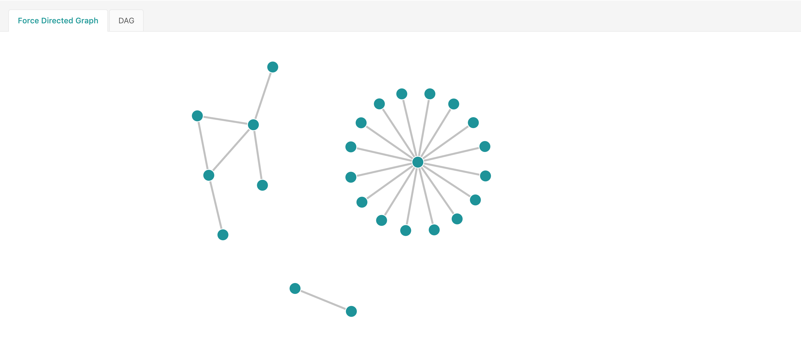

# Build jaeger service dependencies for elasticsearch

[](https://circleci.com/gh/Lookyan/jaeger-dependencies)

An alternative to [spark-dependencies](https://github.com/jaegertracing/spark-dependencies)

Written in golang, without spark. Better for systems with big amount of traces in elasticsearch and small graphs.



## Run

You can use docker image `lookyan/jaeger-dependencies:latest`

Run docker directly:
```bash
docker run --env ES_HOST=http://host:9200 lookyan/jaeger-dependencies:latest
```

Or you can run it in kubernetes as a CronJob:
```yaml
apiVersion: batch/v1beta1
kind: CronJob
metadata:
  name: jaeger-dependencies
  namespace: tracing
spec:
  schedule: "0 22 * * *"
  jobTemplate:
    spec:
      template:
        spec:
          containers:
          - name: jaeger-dependencies
            image: lookyan/jaeger-dependencies
            env:
            - name: "ES_HOST"
              value: "http://elasticsearch-node:9200"
          restartPolicy: Never
```

## Build
```bash
go build ./cmd/main.go
```

## Configuration
`ES_HOST` - ES connection

`ES_INDEX_PREFIX` - ES index prefix

`ES_USERNAME` - ES username

`ES_PASSWORD` - ES password

## How it works
Jaeger-dependencies aggregates traces for previous day in directed graph. It queries ES span index for spans who have `span.kind` equal to `server` and have references. After that it counts number of inter-service communications.
